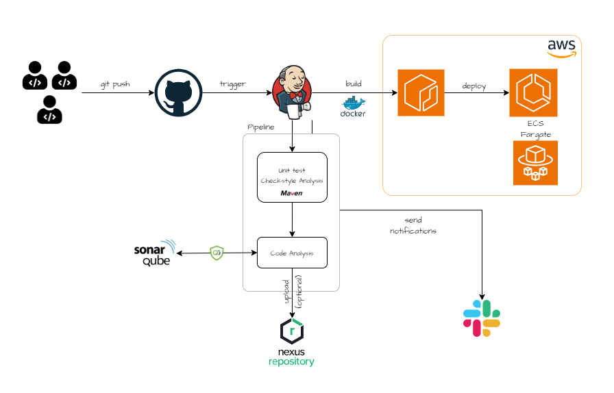

# CICD with Jenkins
> Disclaimer: This project is inspired from Imran Teli's udemy course(DevOps from beginner to advanced). An application source code is originally from Imran, in order to focus on the construction of CI/CD pipeline rather than on application development.

In this project, we will construct a CI/CD pipeline with Jenkins, to deploy a Java app on AWS ECS. The pipeline will be triggered on every push to the main branch of the git repository, which subsequently builds a docker image, pushes it to AWS ECR, and deploys the new image to ECS. 

## Architecture

 

## Prerequisites
1. An AWS account 
2. Basic knowledge of containerization, Linux shell
3. Time commitment

## Technologies 
- Java Spring
- Maven
- Jenkins
- SonarQube
- Nexus
- Docker
- ECR
- ECS

**The instruction steps to setup the project are provided in setup.md**
If you face any issues whilst performing this project, feel free to contact via: mtkforstudy.john86@gmail.com. I will try my best to response as soon as possible with the solution.

